> First time here? Run `codeatlas scan .` to generate the full detail (`.codeatlas/detail/`).

## Diagrams

### Directory Tree

```mermaid
graph TD
    d___root___f1fabfb4["/"]
    d_demo_todo_af73008e["demo-todo"]
    d___root___f1fabfb4 --> d_demo_todo_af73008e
    d_demo_todo_app_c6975872["app"]
    d_demo_todo_af73008e --> d_demo_todo_app_c6975872
    d_todo_app_controllers_a309c4ff["controllers"]
    d_demo_todo_app_c6975872 --> d_todo_app_controllers_a309c4ff
    f_s_task_controller_py_53d29a6d["task_controller.py"]
    d_todo_app_controllers_a309c4ff --> f_s_task_controller_py_53d29a6d
    f_emo_todo_app_main_py_d01174b7["main.py"]
    d_demo_todo_app_c6975872 --> f_emo_todo_app_main_py_d01174b7
    d_demo_todo_app_models_95d91b5d["models"]
    d_demo_todo_app_c6975872 --> d_demo_todo_app_models_95d91b5d
    f_o_app_models_task_py_b52a7bc4["task.py"]
    d_demo_todo_app_models_95d91b5d --> f_o_app_models_task_py_b52a7bc4
    f_o_app_models_user_py_8e368df3["user.py"]
    d_demo_todo_app_models_95d91b5d --> f_o_app_models_user_py_8e368df3
    d_mo_todo_app_services_a84afc58["services"]
    d_demo_todo_app_c6975872 --> d_mo_todo_app_services_a84afc58
    f_ices_auth_service_py_cfaef27a["auth_service.py"]
    d_mo_todo_app_services_a84afc58 --> f_ices_auth_service_py_cfaef27a
    f_ices_task_service_py_cf7adef2["task_service.py"]
    d_mo_todo_app_services_a84afc58 --> f_ices_task_service_py_cf7adef2
    d_demo_todo_app_utils_2f990ce9["utils"]
    d_demo_todo_app_c6975872 --> d_demo_todo_app_utils_2f990ce9
    f__utils_validators_py_00984a64["validators.py"]
    d_demo_todo_app_utils_2f990ce9 --> f__utils_validators_py_00984a64
    d_demo_todo_static_11b780a2["static"]
    d_demo_todo_af73008e --> d_demo_todo_static_11b780a2
    f_static_task_panel_ts_84a17a8c["task_panel.ts"]
    d_demo_todo_static_11b780a2 --> f_static_task_panel_ts_84a17a8c
    d_scripts_d6c5855a["scripts"]
    d___root___f1fabfb4 --> d_scripts_d6c5855a
    f_scripts_probe_ast_py_821708b4["probe_ast.py"]
    d_scripts_d6c5855a --> f_scripts_probe_ast_py_821708b4
    f_scripts_probe_cli_py_61b2660a["probe_cli.py"]
    d_scripts_d6c5855a --> f_scripts_probe_cli_py_61b2660a
    f_pts_probe_indexer_py_f369534f["probe_indexer.py"]
    d_scripts_d6c5855a --> f_pts_probe_indexer_py_f369534f
    f_ipts_probe_parser_py_b5e019be["probe_parser.py"]
    d_scripts_d6c5855a --> f_ipts_probe_parser_py_b5e019be
    f_robe_query_render_py_fa2fe2c9["probe_query_render.py"]
    d_scripts_d6c5855a --> f_robe_query_render_py_fa2fe2c9
    f_cripts_smoke_test_py_769f7b32["smoke_test.py"]
    d_scripts_d6c5855a --> f_cripts_smoke_test_py_769f7b32
    d_src_25d902c2["src"]
    d___root___f1fabfb4 --> d_src_25d902c2
    d_src_codeatlas_9b8859fc["codeatlas"]
    d_src_25d902c2 --> d_src_codeatlas_9b8859fc
    f_odeatlas___init___py_b23e50a1["__init__.py"]
    d_src_codeatlas_9b8859fc --> f_odeatlas___init___py_b23e50a1
    f__codeatlas_budget_py_77d59d5c["budget.py"]
    d_src_codeatlas_9b8859fc --> f__codeatlas_budget_py_77d59d5c
    f_deatlas_callgraph_py_09387f91["callgraph.py"]
    d_src_codeatlas_9b8859fc --> f_deatlas_callgraph_py_09387f91
    f_deatlas_changelog_py_7f95a410["changelog.py"]
    d_src_codeatlas_9b8859fc --> f_deatlas_changelog_py_7f95a410
    f_src_codeatlas_cli_py_023008d7["cli.py"]
    d_src_codeatlas_9b8859fc --> f_src_codeatlas_cli_py_023008d7
    f_atlas_consistency_py_138fcdbe["consistency.py"]
    d_src_codeatlas_9b8859fc --> f_atlas_consistency_py_138fcdbe
    f_odeatlas_diagrams_py_9af4eb3f["diagrams.py"]
    d_src_codeatlas_9b8859fc --> f_odeatlas_diagrams_py_9af4eb3f
    f_c_codeatlas_gates_py_9e6ff91d["gates.py"]
    d_src_codeatlas_9b8859fc --> f_c_codeatlas_gates_py_9e6ff91d
    f_codeatlas_indexer_py_1c986101["indexer.py"]
    d_src_codeatlas_9b8859fc --> f_codeatlas_indexer_py_1c986101
    f_odeatlas_markdown_py_92f67d62["markdown.py"]
    d_src_codeatlas_9b8859fc --> f_odeatlas_markdown_py_92f67d62
    f_eatlas_mcp_server_py_af817111["mcp_server.py"]
    d_src_codeatlas_9b8859fc --> f_eatlas_mcp_server_py_af817111
    f__codeatlas_memory_py_811979e0["memory.py"]
    d_src_codeatlas_9b8859fc --> f__codeatlas_memory_py_811979e0
    f__codeatlas_models_py_4449037a["models.py"]
    d_src_codeatlas_9b8859fc --> f__codeatlas_models_py_4449037a
    f__codeatlas_parser_py_25f5e1b0["parser.py"]
    d_src_codeatlas_9b8859fc --> f__codeatlas_parser_py_25f5e1b0
    f_tlas_plan_context_py_0e972a08["plan_context.py"]
    d_src_codeatlas_9b8859fc --> f_tlas_plan_context_py_0e972a08
    f_atlas_plan_impact_py_7db73181["plan_impact.py"]
    d_src_codeatlas_9b8859fc --> f_atlas_plan_impact_py_7db73181
    f_atlas_plan_memory_py_d50fd2bc["plan_memory.py"]
    d_src_codeatlas_9b8859fc --> f_atlas_plan_memory_py_d50fd2bc
    f_las_plan_workflow_py_4b650276["plan_workflow.py"]
    d_src_codeatlas_9b8859fc --> f_las_plan_workflow_py_4b650276
    f_c_codeatlas_plans_py_9c9c5ceb["plans.py"]
    d_src_codeatlas_9b8859fc --> f_c_codeatlas_plans_py_9c9c5ceb
    f_odeatlas_prefetch_py_2cc85f49["prefetch.py"]
    d_src_codeatlas_9b8859fc --> f_odeatlas_prefetch_py_2cc85f49
    f_codeatlas_scanner_py_8b5a09f9["scanner.py"]
    d_src_codeatlas_9b8859fc --> f_codeatlas_scanner_py_8b5a09f9
    f_codeatlas_service_py_5a00dc73["service.py"]
    d_src_codeatlas_9b8859fc --> f_codeatlas_service_py_5a00dc73
    f_codeatlas_storage_py_c8346aca["storage.py"]
    d_src_codeatlas_9b8859fc --> f_codeatlas_storage_py_c8346aca
    f_eatlas_summarizer_py_e3f8a862["summarizer.py"]
    d_src_codeatlas_9b8859fc --> f_eatlas_summarizer_py_e3f8a862
    d_tests_b61a6d54["tests"]
    d___root___f1fabfb4 --> d_tests_b61a6d54
    f_tests_conftest_py_484462fc["conftest.py"]
    d_tests_b61a6d54 --> f_tests_conftest_py_484462fc
    f_tests_test_budget_py_c3873fcf["test_budget.py"]
    d_tests_b61a6d54 --> f_tests_test_budget_py_c3873fcf
    f_ts_test_callgraph_py_5122bd9d["test_callgraph.py"]
    d_tests_b61a6d54 --> f_ts_test_callgraph_py_5122bd9d
    f_ts_test_changelog_py_c7f314c2["test_changelog.py"]
    d_tests_b61a6d54 --> f_ts_test_changelog_py_c7f314c2
    f_t_consistency_e2e_py_787988a7["test_consistency_e2e.py"]
    d_tests_b61a6d54 --> f_t_consistency_e2e_py_787988a7
    f__test_context_e2e_py_2aa49f07["test_context_e2e.py"]
    d_tests_b61a6d54 --> f__test_context_e2e_py_2aa49f07
    f_sts_test_diagrams_py_beb09a0a["test_diagrams.py"]
    d_tests_b61a6d54 --> f_sts_test_diagrams_py_beb09a0a
    f_execution_quality_py_d66b8b64["test_execution_quality.py"]
    d_tests_b61a6d54 --> f_execution_quality_py_d66b8b64
    f_ests_test_indexer_py_bec50d19["test_indexer.py"]
    d_tests_b61a6d54 --> f_ests_test_indexer_py_bec50d19
    f_sts_test_markdown_py_0ffced02["test_markdown.py"]
    d_tests_b61a6d54 --> f_sts_test_markdown_py_0ffced02
    f_s_test_mcp_server_py_32af053d["test_mcp_server.py"]
    d_tests_b61a6d54 --> f_s_test_mcp_server_py_32af053d
    f_tests_test_memory_py_58229cbd["test_memory.py"]
    d_tests_b61a6d54 --> f_tests_test_memory_py_58229cbd
    f_test_memory_graph_py_e98c680d["test_memory_graph.py"]
    d_tests_b61a6d54 --> f_test_memory_graph_py_e98c680d
    f_tests_test_parser_py_ed9d6689["test_parser.py"]
    d_tests_b61a6d54 --> f_tests_test_parser_py_ed9d6689
    f_hase3_plan_impact_py_2b3cec88["test_phase3_plan_impact.py"]
    d_tests_b61a6d54 --> f_hase3_plan_impact_py_2b3cec88
    f_test_plan_context_py_08072798["test_plan_context.py"]
    d_tests_b61a6d54 --> f_test_plan_context_py_08072798
    f__test_plan_engine_py_7d5efd3d["test_plan_engine.py"]
    d_tests_b61a6d54 --> f__test_plan_engine_py_7d5efd3d
    f_est_plan_workflow_py_3b008049["test_plan_workflow.py"]
    d_tests_b61a6d54 --> f_est_plan_workflow_py_3b008049
    f_sts_test_prefetch_py_d61dc3b5["test_prefetch.py"]
    d_tests_b61a6d54 --> f_sts_test_prefetch_py_d61dc3b5
    f_est_query_history_py_5c516287["test_query_history.py"]
    d_tests_b61a6d54 --> f_est_query_history_py_5c516287
    f_ests_test_scanner_py_a6246478["test_scanner.py"]
    d_tests_b61a6d54 --> f_ests_test_scanner_py_a6246478
    f_ests_test_storage_py_ce0ce06d["test_storage.py"]
    d_tests_b61a6d54 --> f_ests_test_storage_py_ce0ce06d
    f_s_test_summarizer_py_eed59225["test_summarizer.py"]
    d_tests_b61a6d54 --> f_s_test_summarizer_py_eed59225
```

### Module Dependencies

### Class Inheritance

```mermaid
classDiagram
    class c_oller_TaskController_85e43147 {
        TaskController
    }
    class c_app_models_task_Task_e1309af7 {
        Task
    }
    class c_app_models_user_User_2331dc53 {
        User
    }
    class c__service_AuthService_eb766f7c {
        AuthService
    }
    class c__service_TaskService_90941598 {
        TaskService
    }
    class c_task_panel_TaskPanel_e1172c04 {
        TaskPanel
    }
    class c_mory_AmbiguousSymbol_386b8d46 {
        AmbiguousSymbol
    }
    note for c_mory_AmbiguousSymbol_386b8d46 "extends Exception"
    class c_as_models_ChangeType_17480da7 {
        ChangeType
    }
    note for c_as_models_ChangeType_17480da7 "extends str"
    note for c_as_models_ChangeType_17480da7 "extends Enum"
    class c_odeatlas_models_Role_c5d68e68 {
        Role
    }
    note for c_odeatlas_models_Role_c5d68e68 "extends str"
    note for c_odeatlas_models_Role_c5d68e68 "extends Enum"
    class c_as_models_SymbolKind_8d37c271 {
        SymbolKind
    }
    note for c_as_models_SymbolKind_8d37c271 "extends str"
    note for c_as_models_SymbolKind_8d37c271 "extends Enum"
    class c_tlas_plans_PlanError_f4f5a73e {
        PlanError
    }
    note for c_tlas_plans_PlanError_f4f5a73e "extends Exception"
    class c_eatlas_storage_Store_1fe73e2a {
        Store
    }
    class c_rizer_RuleSummarizer_596e2a02 {
        RuleSummarizer
    }
    class c_ummarizer_Summarizer_790cd1b2 {
        Summarizer
    }
    note for c_ummarizer_Summarizer_790cd1b2 "extends Protocol"
```

### Call Graph (approximate)

## Files

| File | Lang | Role | Symbols | Ref'd |
|---|---|---|---:|---:|
| `demo-todo/app/controllers/task_controller.py` | python | controller | 4 | 0 |
| `demo-todo/app/main.py` | python | entry | 1 | 0 |
| `demo-todo/app/models/task.py` | python | model | 3 | 0 |
| `demo-todo/app/models/user.py` | python | model | 2 | 0 |
| `demo-todo/app/services/auth_service.py` | python | service | 3 | 0 |
| `demo-todo/app/services/task_service.py` | python | service | 6 | 0 |
| `demo-todo/app/utils/validators.py` | python | util | 1 | 0 |
| `demo-todo/static/task_panel.ts` | typescript | module | 4 | 0 |
| `scripts/probe_ast.py` | python | module | 1 | 0 |
| `scripts/probe_cli.py` | python | entry | 2 | 0 |
| `scripts/probe_indexer.py` | python | module | 1 | 0 |
| `scripts/probe_parser.py` | python | module | 1 | 0 |
| `scripts/probe_query_render.py` | python | module | 1 | 0 |
| `scripts/smoke_test.py` | python | test | 1 | 0 |
| `src/codeatlas/__init__.py` | python | module | 0 | 0 |
| `src/codeatlas/budget.py` | python | module | 5 | 0 |
| `src/codeatlas/callgraph.py` | python | module | 8 | 0 |
| `src/codeatlas/changelog.py` | python | module | 5 | 0 |
| `src/codeatlas/cli.py` | python | entry | 8 | 0 |
| `src/codeatlas/consistency.py` | python | module | 7 | 0 |
| `src/codeatlas/diagrams.py` | python | module | 7 | 0 |
| `src/codeatlas/gates.py` | python | module | 2 | 0 |
| `src/codeatlas/indexer.py` | python | module | 12 | 0 |
| `src/codeatlas/markdown.py` | python | module | 6 | 0 |
| `src/codeatlas/mcp_server.py` | python | module | 7 | 0 |
| `src/codeatlas/memory.py` | python | module | 26 | 0 |
| `src/codeatlas/models.py` | python | module | 3 | 0 |
| `src/codeatlas/parser.py` | python | module | 19 | 0 |
| `src/codeatlas/plan_context.py` | python | module | 9 | 0 |
| `src/codeatlas/plan_impact.py` | python | module | 10 | 0 |
| `src/codeatlas/plan_memory.py` | python | module | 13 | 0 |
| `src/codeatlas/plan_workflow.py` | python | module | 42 | 0 |
| `src/codeatlas/plans.py` | python | module | 34 | 0 |
| `src/codeatlas/prefetch.py` | python | module | 5 | 0 |
| `src/codeatlas/scanner.py` | python | module | 2 | 0 |
| `src/codeatlas/service.py` | python | module | 19 | 0 |
| `src/codeatlas/storage.py` | python | module | 46 | 0 |
| `src/codeatlas/summarizer.py` | python | module | 10 | 0 |
| `tests/conftest.py` | python | test | 0 | 0 |
| `tests/test_budget.py` | python | test | 7 | 0 |
| `tests/test_callgraph.py` | python | test | 9 | 0 |
| `tests/test_changelog.py` | python | test | 11 | 0 |
| `tests/test_consistency_e2e.py` | python | test | 7 | 0 |
| `tests/test_context_e2e.py` | python | test | 13 | 0 |
| `tests/test_diagrams.py` | python | test | 10 | 0 |
| `tests/test_execution_quality.py` | python | test | 16 | 0 |
| `tests/test_indexer.py` | python | test | 9 | 0 |
| `tests/test_markdown.py` | python | test | 6 | 0 |
| `tests/test_mcp_server.py` | python | test | 25 | 0 |
| `tests/test_memory.py` | python | test | 22 | 0 |
| `tests/test_memory_graph.py` | python | test | 9 | 0 |
| `tests/test_parser.py` | python | test | 6 | 0 |
| `tests/test_phase3_plan_impact.py` | python | test | 27 | 0 |
| `tests/test_plan_context.py` | python | test | 6 | 0 |
| `tests/test_plan_engine.py` | python | test | 16 | 0 |
| `tests/test_plan_workflow.py` | python | test | 18 | 0 |
| `tests/test_prefetch.py` | python | test | 8 | 0 |
| `tests/test_query_history.py` | python | test | 6 | 0 |
| `tests/test_scanner.py` | python | test | 5 | 0 |
| `tests/test_storage.py` | python | test | 6 | 0 |
| `tests/test_summarizer.py` | python | test | 6 | 0 |

## Recent Changes

- [2026-09-18_1543.md](.codeatlas/history/2026-09-18_1543.md)
- [2026-09-18_1541.md](.codeatlas/history/2026-09-18_1541.md)
- [2026-09-18_1533.md](.codeatlas/history/2026-09-18_1533.md)
- [2026-09-18_1500.md](.codeatlas/history/2026-09-18_1500.md)
- [2026-09-18_1135.md](.codeatlas/history/2026-09-18_1135.md)
