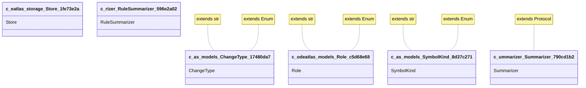

> 首次使用请运行 `codeatlas scan .` 生成完整明细（.codeatlas/detail/）。

## 架构图 / Diagrams

### 目录结构 / Directory Tree

```mermaid
graph TD
    d___root___f1fabfb4["/"]
    d_scripts_d6c5855a["scripts"]
    d___root___f1fabfb4 --> d_scripts_d6c5855a
    f_scripts_probe_ast_py_821708b4["probe_ast.py"]
    d_scripts_d6c5855a --> f_scripts_probe_ast_py_821708b4
    f_scripts_probe_cli_py_61b2660a["probe_cli.py"]
    d_scripts_d6c5855a --> f_scripts_probe_cli_py_61b2660a
    f_pts_probe_indexer_py_f369534f["probe_indexer.py"]
    d_scripts_d6c5855a --> f_pts_probe_indexer_py_f369534f
    f_ipts_probe_parser_py_b5e019be["probe_parser.py"]
    d_scripts_d6c5855a --> f_ipts_probe_parser_py_b5e019be
    f_robe_query_render_py_fa2fe2c9["probe_query_render.py"]
    d_scripts_d6c5855a --> f_robe_query_render_py_fa2fe2c9
    f_cripts_smoke_test_py_769f7b32["smoke_test.py"]
    d_scripts_d6c5855a --> f_cripts_smoke_test_py_769f7b32
    d_src_25d902c2["src"]
    d___root___f1fabfb4 --> d_src_25d902c2
    d_src_codeatlas_9b8859fc["codeatlas"]
    d_src_25d902c2 --> d_src_codeatlas_9b8859fc
    f_odeatlas___init___py_b23e50a1["__init__.py"]
    d_src_codeatlas_9b8859fc --> f_odeatlas___init___py_b23e50a1
    f_deatlas_changelog_py_7f95a410["changelog.py"]
    d_src_codeatlas_9b8859fc --> f_deatlas_changelog_py_7f95a410
    f_src_codeatlas_cli_py_023008d7["cli.py"]
    d_src_codeatlas_9b8859fc --> f_src_codeatlas_cli_py_023008d7
    f_odeatlas_diagrams_py_9af4eb3f["diagrams.py"]
    d_src_codeatlas_9b8859fc --> f_odeatlas_diagrams_py_9af4eb3f
    f_codeatlas_indexer_py_1c986101["indexer.py"]
    d_src_codeatlas_9b8859fc --> f_codeatlas_indexer_py_1c986101
    f_odeatlas_markdown_py_92f67d62["markdown.py"]
    d_src_codeatlas_9b8859fc --> f_odeatlas_markdown_py_92f67d62
    f__codeatlas_models_py_4449037a["models.py"]
    d_src_codeatlas_9b8859fc --> f__codeatlas_models_py_4449037a
    f__codeatlas_parser_py_25f5e1b0["parser.py"]
    d_src_codeatlas_9b8859fc --> f__codeatlas_parser_py_25f5e1b0
    f_codeatlas_scanner_py_8b5a09f9["scanner.py"]
    d_src_codeatlas_9b8859fc --> f_codeatlas_scanner_py_8b5a09f9
    f_codeatlas_storage_py_c8346aca["storage.py"]
    d_src_codeatlas_9b8859fc --> f_codeatlas_storage_py_c8346aca
    f_eatlas_summarizer_py_e3f8a862["summarizer.py"]
    d_src_codeatlas_9b8859fc --> f_eatlas_summarizer_py_e3f8a862
    d_tests_b61a6d54["tests"]
    d___root___f1fabfb4 --> d_tests_b61a6d54
    f_tests_conftest_py_484462fc["conftest.py"]
    d_tests_b61a6d54 --> f_tests_conftest_py_484462fc
    f_ts_test_changelog_py_c7f314c2["test_changelog.py"]
    d_tests_b61a6d54 --> f_ts_test_changelog_py_c7f314c2
    f_t_consistency_e2e_py_787988a7["test_consistency_e2e.py"]
    d_tests_b61a6d54 --> f_t_consistency_e2e_py_787988a7
    f_sts_test_diagrams_py_beb09a0a["test_diagrams.py"]
    d_tests_b61a6d54 --> f_sts_test_diagrams_py_beb09a0a
    f_ests_test_indexer_py_bec50d19["test_indexer.py"]
    d_tests_b61a6d54 --> f_ests_test_indexer_py_bec50d19
    f_sts_test_markdown_py_0ffced02["test_markdown.py"]
    d_tests_b61a6d54 --> f_sts_test_markdown_py_0ffced02
    f_tests_test_parser_py_ed9d6689["test_parser.py"]
    d_tests_b61a6d54 --> f_tests_test_parser_py_ed9d6689
    f_est_query_history_py_5c516287["test_query_history.py"]
    d_tests_b61a6d54 --> f_est_query_history_py_5c516287
    f_ests_test_scanner_py_a6246478["test_scanner.py"]
    d_tests_b61a6d54 --> f_ests_test_scanner_py_a6246478
    f_ests_test_storage_py_ce0ce06d["test_storage.py"]
    d_tests_b61a6d54 --> f_ests_test_storage_py_ce0ce06d
    f_s_test_summarizer_py_eed59225["test_summarizer.py"]
    d_tests_b61a6d54 --> f_s_test_summarizer_py_eed59225
```

### 模块依赖 / Module Dependencies

### 类继承 / Class Inheritance

## 文件索引 / Files

| 文件 | 语言 | 角色 | 符号数 | 被引用 |
|---|---|---|---:|---:|
| `scripts/probe_ast.py` | python | module | 1 | 0 |
| `scripts/probe_cli.py` | python | entry | 2 | 0 |
| `scripts/probe_indexer.py` | python | module | 1 | 0 |
| `scripts/probe_parser.py` | python | module | 1 | 0 |
| `scripts/probe_query_render.py` | python | module | 1 | 0 |
| `scripts/smoke_test.py` | python | test | 1 | 0 |
| `src/codeatlas/__init__.py` | python | module | 0 | 0 |
| `src/codeatlas/changelog.py` | python | module | 5 | 0 |
| `src/codeatlas/cli.py` | python | entry | 5 | 0 |
| `src/codeatlas/diagrams.py` | python | module | 6 | 0 |
| `src/codeatlas/indexer.py` | python | module | 9 | 0 |
| `src/codeatlas/markdown.py` | python | module | 6 | 0 |
| `src/codeatlas/models.py` | python | module | 3 | 0 |
| `src/codeatlas/parser.py` | python | module | 15 | 0 |
| `src/codeatlas/scanner.py` | python | module | 2 | 0 |
| `src/codeatlas/storage.py` | python | module | 20 | 0 |
| `src/codeatlas/summarizer.py` | python | module | 10 | 0 |
| `tests/conftest.py` | python | test | 0 | 0 |
| `tests/test_changelog.py` | python | test | 5 | 0 |
| `tests/test_consistency_e2e.py` | python | test | 8 | 0 |
| `tests/test_diagrams.py` | python | test | 7 | 0 |
| `tests/test_indexer.py` | python | test | 9 | 0 |
| `tests/test_markdown.py` | python | test | 6 | 0 |
| `tests/test_parser.py` | python | test | 6 | 0 |
| `tests/test_query_history.py` | python | test | 6 | 0 |
| `tests/test_scanner.py` | python | test | 5 | 0 |
| `tests/test_storage.py` | python | test | 5 | 0 |
| `tests/test_summarizer.py` | python | test | 6 | 0 |

## 最近变更记录 / Recent Changes

- [2026-09-14_1355.md](.codeatlas/history/2026-09-14_1355.md)
- [2026-09-14_1352.md](.codeatlas/history/2026-09-14_1352.md)
