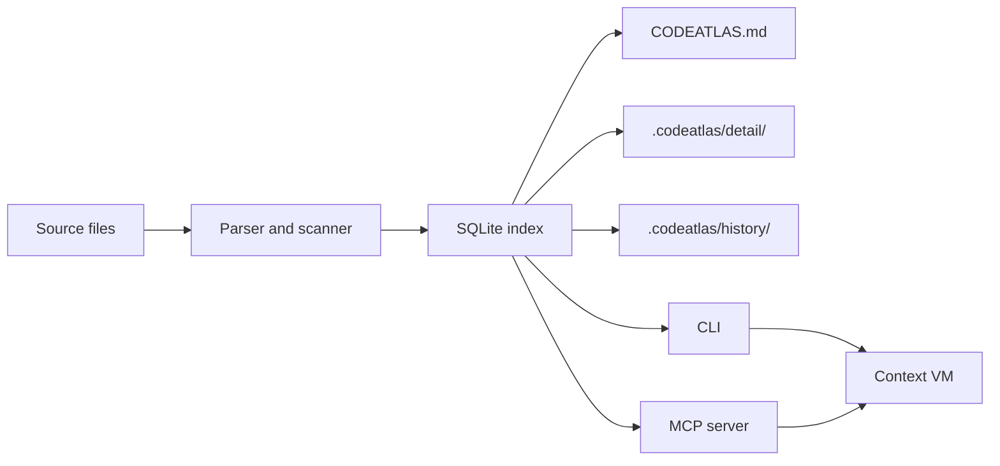
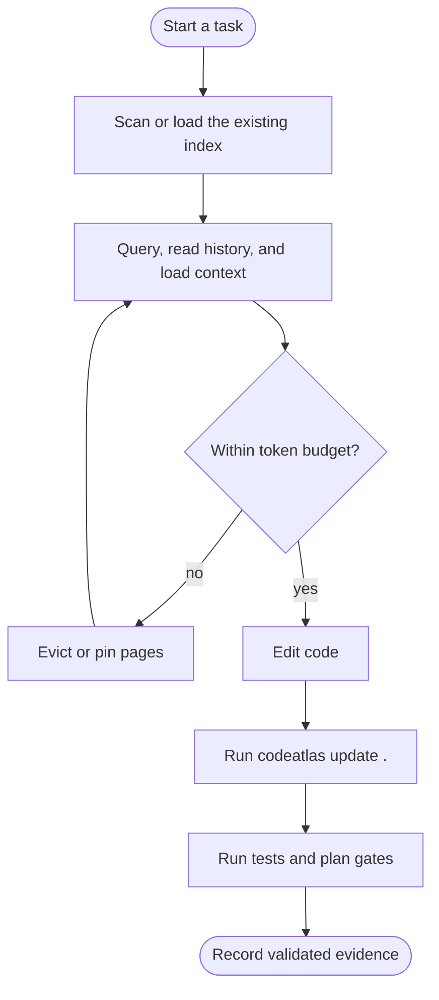

# CodeAtlas

> Persistent code index and architecture memory for AI-assisted development.

**This project is not affiliated with any other project named CodeAtlas.**

[English](README.md) | [简体中文](README.zh-CN.md)

## Overview

CodeAtlas gives AI coding assistants a durable, local memory of a repository. It
indexes symbols, renders architecture diagrams, records body-level change
history, and pages selected context into a token-budgeted working set instead of
re-reading whole files on every task.

| Capability | What it provides |
|---|---|
| Layered index | `CODEATLAS.md` overview plus per-module detail shards |
| Architecture views | Directory tree, module dependencies, class inheritance, and approximate call graph |
| Change history | Symbol evolution, signatures, renames, and body-change summaries per update |
| Context VM | A token-budgeted working set with eviction, pinning, and prefetch |
| Durable plans | Reviewable plan lifecycle with approvals, batches, gates, and evidence |
| MCP integration | An agent-facing stdio server over the same local index |

## Install

> [!NOTE]
> CodeAtlas is installed from source in this release. It is not published to
> PyPI yet. Python 3.11+ and [uv](https://docs.astral.sh/uv/) are recommended.

```bash
git clone https://github.com/1084669403/codeatlas-memory
cd codeatlas-memory
uv sync --extra mcp
uv run codeatlas --help
```

## Quick start

Run these commands from the repository you want to understand:

```bash
# Build the first index and generated Markdown views
codeatlas scan .

# Search symbols with ranked full-text search
codeatlas query "TaskController"

# Inspect a symbol's evolution before refactoring it
codeatlas history TaskController

# Page one symbol into the context working set
codeatlas context load TaskController
codeatlas context status

# After AI edits, refresh changed files and record history
codeatlas update .
```

The bundled `demo-todo` project contains real examples such as `TaskController`
and `mark_done`.

## Architecture



The CLI and MCP server read the same local index. They do not require a cloud
service or an external embedding store.

## Usage flow



## Context VM

`context load` prints one Markdown page and adds it to a scoped working set.
`context status` shows pages, token use, stale pages, and budget. `context
evict` removes pages; pinned pages are retained unless explicitly forced out.

Working sets are scoped by batch, plan, and session. When more than one scope
is supplied, the precedence is `batch > plan > session > global`:

```bash
codeatlas context load TaskController --session refactor-auth
codeatlas context status --session refactor-auth
codeatlas context evict --all --session refactor-auth
```

Scope writes use a short-lived lease so a crashed writer cannot hold a working
set indefinitely. CLI and MCP writers participate in the same lease protocol.

## Durable plan workflow

For non-trivial changes, keep task state in the repository instead of in chat
history:

```bash
codeatlas plan context "<task description>" --json
codeatlas plan new <plan-slug> . --json
codeatlas plan approve <plan-id> . --approved-by "Human reviewer" --json
codeatlas plan batch start <plan-id> B1 . --expected-revision <revision> --json
codeatlas plan gate run <plan-id> B1 unit-tests . --json
codeatlas plan batch complete <plan-id> B1 . --expected-revision <revision> --json
```

Markdown in `docs/plans/` is authoritative. Gate evidence is checked against a
plan revision, so a later code change cannot silently reuse old evidence.

## MCP server

The optional MCP extra exposes an agent-facing stdio server:

| Tool | Purpose |
|---|---|
| `scan_project` | Build the initial index |
| `update_index` | Re-index changed files and record history |
| `overview` | Read `CODEATLAS.md` |
| `module_detail` | Read one module detail shard |
| `search_symbols` | Search symbols, including Chinese text |
| `symbol_history` | Inspect a symbol evolution chain |
| `plan_context` | Retrieve bounded, evidence-backed planning context |
| `context_load` | Load a page into the working set |
| `context_status` | Inspect working-set status and budget |
| `context_evict` | Evict, pin, or unpin pages |
| `doctor` | Run consistency checks |

Register the local executable, not a PyPI package:

```json
{
  "mcpServers": {
    "codeatlas": {
      "command": "/absolute/path/to/repo/.venv/bin/codeatlas-mcp",
      "args": [],
      "env": {
        "CODEATLAS_ROOT": "/absolute/path/to/project"
      }
    }
  }
}
```

On Windows, use `.venv\\Scripts\\codeatlas-mcp.exe`. Set `CODEATLAS_ROOT` to
the repository that the agent should index.

## Generated artifacts

```text
CODEATLAS.md                 # Generated overview and diagrams
.codeatlas/
  state.db                   # SQLite index (regenerable)
  detail/                    # Generated module shards (regenerable)
  history/                   # Durable change records
```

`.codeatlas/.gitignore` is generated so `state.db` and `detail/` stay out of
Git while `history/` can be committed.

## Development

```bash
uv sync --extra mcp
uv run pytest
```

CI covers Linux on Python 3.11, 3.12, and 3.13, plus Windows on Python 3.13.

## Known limitations

- Supported languages are Python, JavaScript, and TypeScript/TSX.
- The call graph is approximate. Decorator calls, dynamic dispatch, and
  higher-order callbacks may be missing or attributed approximately.
- Import resolution is heuristic. Dynamic imports, aliases, and re-exports may
  be missed.
- Rename detection is heuristic, based on same-file add/remove pairs and
  compatible signature shapes.
- Large `scan_project` or `update_index` calls through MCP may exceed client
  timeouts; prefer the CLI for large repositories.
- macOS is not covered by the current CI matrix.
- Windows console output can replace characters that are not printable in GBK.
- The current release does not include semantic search, Git-aware rollback,
  file watchers, or description enrichment.

## Roadmap

| Stage | Status |
|---|---|
| Core indexing, diagrams, history, and query | Done |
| Durable plan lifecycle and gate evidence | Done |
| MCP stdio server | Done |
| Scoped context VM and short-lived leases | Done |
| Operational hardening and broader language support | Next |
| Semantic search, rollback, watchers, and enrichment | Later, not started |

## License

MIT. See [LICENSE](LICENSE).
