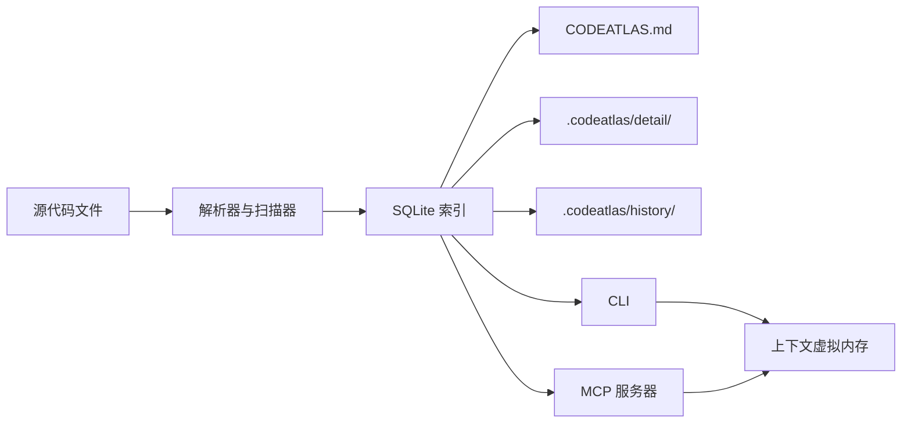
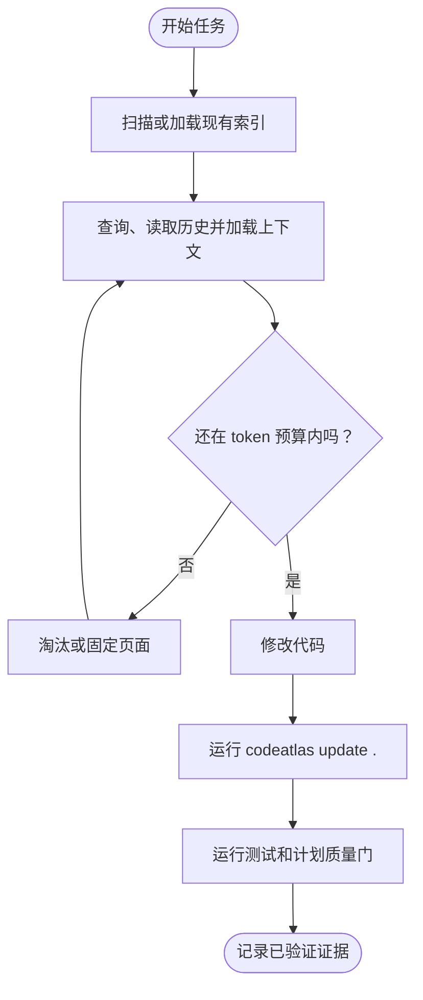

# CodeAtlas

> 为 AI 辅助开发提供的持久代码索引与架构记忆。

**本项目与其它同名 CodeAtlas 项目无关。**

[English](README.md) | [简体中文](README.zh-CN.md)

## 项目概览

CodeAtlas 给 AI 编程助手一个可持久保留的本地项目记忆。它索引符号、渲染架构图、
记录函数体级别的变更历史，并把需要的上下文按页加载进受 token 预算约束的工作集，
避免每次任务都重新读取大量文件。

| 能力 | 作用 |
|---|---|
| 分层索引 | `CODEATLAS.md` 总览，加上按模块拆分的详细索引 |
| 架构视图 | 目录树、模块依赖、类继承和近似调用图 |
| 变更历史 | 符号演变、签名变化、重命名和每次更新中的函数体变更 |
| 上下文虚拟内存 | 受预算约束的工作集，支持淘汰、固定和邻域预取 |
| 持久计划 | 可审查的计划生命周期，包含批准、批次、质量门和证据 |
| MCP 集成 | 通过 stdio 服务器向 agent 暴露同一份本地索引 |

## 安装

> [!NOTE]
> 当前版本通过源码安装，还没有发布到 PyPI。建议使用 Python 3.11+ 和
> [uv](https://docs.astral.sh/uv/)。

```bash
git clone https://github.com/1084669403/codeatlas-memory
cd codeatlas-memory
uv sync --extra mcp
uv run codeatlas --help
```

## 快速开始

在要分析的仓库里运行：

```bash
# 建立首个索引和生成的 Markdown 视图
codeatlas scan .

# 用排序后的全文检索查找符号
codeatlas query "TaskController"

# 重构前查看符号演变链
codeatlas history TaskController

# 把一个符号加载进上下文工作集
codeatlas context load TaskController
codeatlas context status

# AI 修改完成后，增量更新索引并记录历史
codeatlas update .
```

仓库自带的 `demo-todo` 包含 `TaskController`、`mark_done` 等真实示例。

## 架构



CLI 和 MCP 服务器读取同一份本地索引，不需要云服务，也不依赖外部向量库。

## 使用流程



## 上下文虚拟内存

`context load` 会输出一个 Markdown 页面，并把它加入有作用域的工作集。
`context status` 显示页面、token 使用量、过期页面和预算。`context evict`
用于淘汰页面；已固定的页面会被保留，除非显式强制淘汰。

工作集按批次、计划和会话隔离。同时提供多个作用域时，优先级是
`batch > plan > session > global`：

```bash
codeatlas context load TaskController --session refactor-auth
codeatlas context status --session refactor-auth
codeatlas context evict --all --session refactor-auth
```

作用域写入使用短租约，避免崩溃的写入者长期占用工作集。CLI 和 MCP 写入者
参与同一套租约协议。

## 持久计划工作流

对非小改动，应把任务状态保存在仓库里，而不是只留在会话历史中：

```bash
codeatlas plan context "<任务描述>" --json
codeatlas plan new <plan-slug> . --json
codeatlas plan approve <plan-id> . --approved-by "人工审查者" --json
codeatlas plan batch start <plan-id> B1 . --expected-revision <revision> --json
codeatlas plan gate run <plan-id> B1 unit-tests . --json
codeatlas plan batch complete <plan-id> B1 . --expected-revision <revision> --json
```

`docs/plans/` 中的 Markdown 是权威状态。质量门证据绑定到计划 revision，
后续代码变化不会静默复用旧证据。

## MCP 服务器

可选的 MCP extra 会启动面向 agent 的 stdio 服务器：

| 工具 | 作用 |
|---|---|
| `scan_project` | 建立初始索引 |
| `update_index` | 增量更新变更文件并记录历史 |
| `overview` | 读取 `CODEATLAS.md` |
| `module_detail` | 读取单个模块的详细索引 |
| `search_symbols` | 搜索符号，支持中文 |
| `symbol_history` | 查看符号演变链 |
| `plan_context` | 检索有界的、有证据支撑的计划上下文 |
| `context_load` | 加载页面到工作集 |
| `context_status` | 查看工作集状态和预算 |
| `context_evict` | 淘汰、固定或取消固定页面 |
| `doctor` | 执行一致性检查 |

请注册本地可执行文件，而不是 PyPI 包：

```json
{
  "mcpServers": {
    "codeatlas": {
      "command": "/absolute/path/to/repo/.venv/bin/codeatlas-mcp",
      "args": [],
      "env": {
        "CODEATLAS_ROOT": "/absolute/path/to/project"
      }
    }
  }
}
```

Windows 使用 `.venv\\Scripts\\codeatlas-mcp.exe`。`CODEATLAS_ROOT` 设置为
agent 要索引的仓库绝对路径。

## 生成产物

```text
CODEATLAS.md                 # 生成的总览和架构图
.codeatlas/
  state.db                   # SQLite 索引（可重新生成）
  detail/                    # 生成的模块详细索引（可重新生成）
  history/                   # 持久变更记录
```

`.codeatlas/.gitignore` 会自动生成：`state.db` 和 `detail/` 不进入 Git，
`history/` 可以提交。

## 开发

```bash
uv sync --extra mcp
uv run pytest
```

CI 覆盖 Linux 上的 Python 3.11、3.12、3.13，以及 Windows 和 macOS 上的 Python 3.13。

## 已知限制

- 当前支持 Python、JavaScript、TypeScript/TSX 和 Go。
- 调用图是近似结果。装饰器调用、动态分派和高阶回调可能缺失或被近似归因。
- 导入解析是启发式的。动态导入、别名和重导出可能被遗漏。
- 重命名检测是启发式的，基于同文件的新增/删除符号对和兼容的签名形状。
- 在大型仓库中，MCP 的 `scan_project` 或 `update_index` 可能超过客户端超时；
  建议改用 CLI。
- 当前版本不包含语义搜索、Git 感知回滚、文件监听器或描述增强。

## 路线图

| 阶段 | 状态 |
|---|---|
| 核心索引、架构图、历史记录和查询 | 完成 |
| 持久计划生命周期和质量门证据 | 完成 |
| MCP stdio 服务器 | 完成 |
| 有作用域的上下文虚拟内存和短租约 | 完成 |
| 运维加固和更多语言支持 | 完成 |
| 语义搜索、回滚、监听器和描述增强 | 后续，尚未开始 |

## 许可证

MIT。详见 [LICENSE](LICENSE)。
