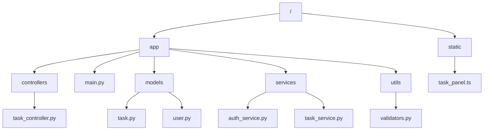
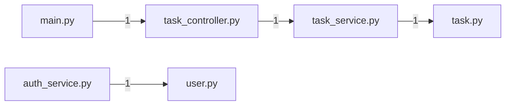
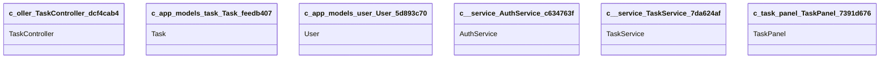

> 首次使用请运行 `codeatlas scan .` 生成完整明细（.codeatlas/detail/）。

## 架构图 / Diagrams

### 目录结构 / Directory Tree

### 模块依赖 / Module Dependencies

### 类继承 / Class Inheritance

## 文件索引 / Files

| 文件 | 语言 | 角色 | 符号数 | 被引用 |
|---|---|---|---:|---:|
| `app/controllers/task_controller.py` | python | controller | 4 | 1 |
| `app/main.py` | python | entry | 1 | 0 |
| `app/models/task.py` | python | model | 3 | 1 |
| `app/models/user.py` | python | model | 2 | 1 |
| `app/services/auth_service.py` | python | service | 3 | 0 |
| `app/services/task_service.py` | python | service | 6 | 1 |
| `app/utils/validators.py` | python | util | 1 | 0 |
| `static/task_panel.ts` | typescript | module | 4 | 0 |
