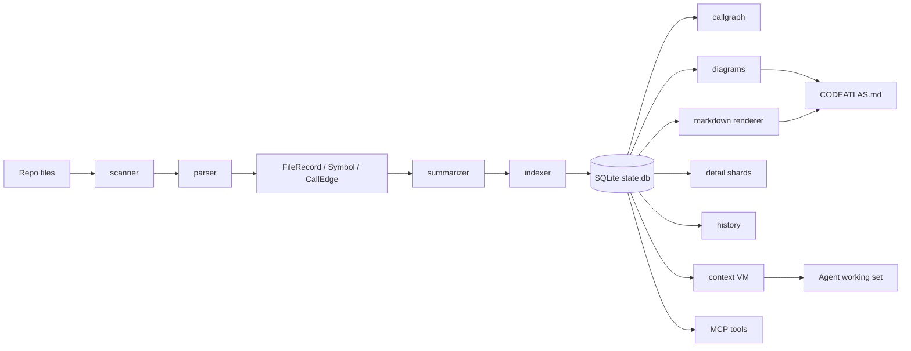

# CodeAtlas 现状分析与 plan-artifacts 融合路线图

Status: draft  
Created: 2026-09-16  
Scope: 现状梳理 / 功能拆解 / 约束与风险 / 与 `plan-artifacts` 的融合优化

## 1. 项目定位

CodeAtlas 的核心目标不是替代 Codex、Cursor 或 Claude Code，而是给这些 AI 工具一个**可持久化、可增量更新、按需加载的项目记忆层**。它把代码仓库转换成三类可被 Agent 消费的信息：

1. **结构记忆**：`CODEATLAS.md` 总览、模块明细分片、Mermaid 图。
2. **变化记忆**：符号级历史、签名/函数体变化、重命名链、回滚上下文。
3. **上下文记忆**：`context load` 的虚拟内存工作集，按 token 预算只加载相关内容。

可以把当前项目概括为：

> CodeAtlas = 代码索引 + 架构描述 + 符号历史 + LLM 虚拟内存 + MCP 接口。

这与你的初衷是一致的：让 AI 工具在开发前先看懂项目，在开发后更新项目认知，在需要回滚时能找到历史证据。

## 2. 当前能力总览

| 层 | 当前能力 | 主要产物 / 入口 |
|---|---|---|
| 扫描 | 识别 `.py` / `.js` / `.mjs` / `.cjs` / `.jsx` / `.ts` / `.tsx`，尊重 `.gitignore` | `codeatlas scan .` |
| 解析 | 用 tree-sitter 提取函数、类、方法、接口、类型别名、签名、参数、返回值、docstring/JSDoc、imports、calls、body | `src/codeatlas/parser.py` |
| 增量更新 | 只重解析变更文件，识别新增、删除、签名变化、签名未变但函数体变化、重命名链 | `codeatlas update .` |
| 存储 | SQLite/WAL 保存 files、symbols、refs、changes、raw_calls、call_edges、pages、working_set | `.codeatlas/state.db` |
| 描述 | 规则式摘要：优先 docstring/JSDoc 首句，否则双语模板；推断 controller/service/model/util/test/entry/module/component 等角色 | `src/codeatlas/summarizer.py` |
| 图表 | 目录树、模块依赖、类继承、近似调用图 | `CODEATLAS.md` |
| 明细分片 | 按顶层目录生成符号级 Markdown 明细 | `.codeatlas/detail/*.md` |
| 历史 | 每次 update 写入历史 Markdown；`changes` 表 append-only | `.codeatlas/history/*.md` |
| 搜索 | FTS5 trigram，缺失时 LIKE fallback，支持中英文符号搜索 | `codeatlas query` |
| 上下文 VM | 符号/文件页、token 预算、LRU 风格淘汰、锚点局部性、邻居预取、pin、stale/gone 标记 | `codeatlas context load/status/evict/budget/ws` |
| Agent 接入 | 10 个 MCP 工具，供 Cursor/Claude Code/其他 MCP 客户端调用 | `codeatlas mcp` |
| 体检 | 一致性不变量：磁盘符号、FTS 同步、悬空 refs、历史文件、调用图、working set | `codeatlas doctor` |

## 3. 核心数据流



## 4. 关键模块分析

### 4.1 scanner 与 parser

`scanner.py` 目前是轻量文件发现层，支持 7 个常见前后端扩展名，并尊重 `.gitignore`。

`parser.py` 是项目的语义提取核心，负责把源码变成结构化记录：

- Python：函数、类、方法、签名、参数、返回值、docstring、imports、函数体内调用。
- JavaScript / TypeScript / TSX：函数、类、接口、类型别名、JSDoc、imports、调用。
- 保留函数体的规范化文本，供后续函数体 diff 使用。
- 函数体有 64KB 截断上限，避免超大函数拖垮 diff 和渲染。

当前解析是“结构 + 启发式语义”的混合体。它能稳定拿到 AST 级符号，但对动态语言行为仍有限制。

### 4.2 indexer、diff 与 history

`indexer.py` 的价值在于把“全量扫描”和“增量更新”分开：

- `run_scan`：清空并重建当前状态，记录初始 `added`。
- `run_update`：先按 mtime/size 粗筛，再用 content hash 校验，只重解析真正变化的文件。
- `diff_file_symbols`：识别 added / removed / signature_changed / signature_stable。
- `detect_renames`：把同文件内“签名形状相同的一删一增”识别为重命名。
- `invalidate_stale`：更新后让已加载的 context page 变成 stale 或 gone。

历史表是 append-only 的，`changes_for_symbol()` 可以直接构建符号演变链。这是当前项目最有长期价值的能力之一。

不过要注意：当前记录的是签名、变更类型和 body diff 行数，不是完整旧源码快照。因此它更适合作为**回滚上下文**，而不是一键回滚引擎。

### 4.3 storage

`storage.py` 用 SQLite 做单项目状态库，设计上有几个正确决策：

- WAL 模式：适合未来更多并发读。
- `symbols` 存当前态，`changes` 存追加历史，二者分离让 history 查询轻量。
- 所有路径统一为 repo-relative POSIX string，降低跨平台问题。
- `raw_calls` 与 `call_edges` 分离：先保留原始调用证据，再启发式解析成边。

当前表已经足够支撑索引、搜索、历史和上下文 VM。后续如果要加语义搜索或任务记忆，最好在这个层上扩展，而不是把所有信息塞进 Markdown。

### 4.4 diagrams

`diagrams.py` 目前生成四张图：

1. Directory Tree。
2. Module Dependencies。
3. Class Inheritance。
4. Call Graph。

实现上已经考虑了 Mermaid 的实际痛点：

- 对节点文本做 `_clean()` 清洗，避免括号、引号、列表前缀导致渲染失败。
- 节点 ID 用 hash + safe suffix，保证跨次运行稳定，便于 diff 审查。
- 依赖图和调用图设置最大边数，防止大项目图不可读。
- 调用图明确标注 `%% approximate`，诚实地表达它是近似结果。

这部分已经是很好的“文字 + 图”骨架。后续可以增强的是“图与任务的关联”：比如只展示某次计划涉及的子图，而不是每次都给全仓大图。

### 4.5 markdown renderer

`markdown.py` 输出两层文档：

- `CODEATLAS.md`：项目总览、frontmatter、四张图、每文件索引表、最近历史链接。
- `.codeatlas/detail/*.md`：按顶层目录拆分的符号明细。

它还有一个很好的机制：`--max-tokens` 时按文件入度排序保留“架构主干”，省略低权重文件并显式提示 omitted 数量。这说明项目已经在朝“给 AI 看的文档应该有预算”的方向走。

### 4.6 summarizer

`summarizer.py` 目前是规则式：

- docstring / JSDoc 首句优先。
- 否则用中英文模板生成基础描述。
- 通过路径和命名推断文件角色。

这对 MVP 是合理的，因为快、便宜、稳定。但它只能说明“这个符号是什么”，还不能很好说明“这个符号为什么存在、它解决什么业务问题、修改它会影响什么”。这是后续最值得增强的点之一。

### 4.7 context VM

这是 CodeAtlas 当前最像“cache / virtual memory”的部分。

它支持：

- 函数粒度页和文件粒度页。
- token 预算：默认 total 8000、working set 6000、max pages 50。
- CJK-aware token 估算，避免中文被按英文习惯低估。
- LRU 风格淘汰，结合 recency 和 locality。
- prefetch 页在淘汰时被降权，真实加载页优先保留。
- pin 防止关键页被驱逐。
- stale / gone 状态跟踪。
- `context ws` 合并输出工作集。

这个模块已经实现了你想要的“只取相关内容，节省 token”的基础形态。后续更重要的是让 Agent 知道**什么时候该 load 哪些页**。

### 4.8 CLI 与 MCP

CLI 是完整控制面：

```bash
codeatlas scan .
codeatlas update .
codeatlas query <keyword>
codeatlas history <symbol>
codeatlas doctor
codeatlas context load <symbol|file>
codeatlas context status
codeatlas context evict <page|--all>
codeatlas context budget
codeatlas context ws
codeatlas mcp
```

MCP 已经暴露 10 个工具：

| Tool | 作用 |
|---|---|
| `overview` | 读项目总览 |
| `module_detail` | 读单模块明细 |
| `search_symbols` | 符号搜索 |
| `symbol_history` | 符号演变链 |
| `context_load` | 加载一页到工作集 |
| `context_status` | 查看工作集状态 |
| `context_evict` | 淘汰或钉住页面 |
| `scan_project` | 初始化索引 |
| `update_index` | 增量更新索引 |
| `doctor` | 一致性体检 |

这已经具备接入 Cursor / Claude Code / Codex 类工具的接口面。对 Codex 而言，CLI + `AGENTS.md` 已经可用；MCP 则更适合更结构化的客户端。

### 4.9 doctor

`doctor.py` 当前检查 6 类一致性：

1. 磁盘符号一致性。
2. FTS 同步。
3. 悬空 refs。
4. update 后历史存在。
5. 调用图健康。
6. working set 健康。

这是很好的工程护栏。后续如果有计划文件、任务状态、代码回滚等新实体，也应该把它们纳入 doctor。

## 5. 当前项目的优势

1. **定位清晰**：不做 Agent 本身，只做项目记忆层。
2. **数据模型正确**：当前态与 append-only 历史分离，方向健康。
3. **上下文成本意识强**：从 overview 到 detail 到 context page，都是分层加载。
4. **Agent 可用性高**：同时有 CLI、MCP 和 `AGENTS.md` 约定。
5. **图表已经能落地**：四张 Mermaid 图加上文件表，已能帮助 AI 快速建立结构感。
6. **增量更新闭环基本成立**：scan → edit → update → history → stale 标记。
7. **工程质量不错**：SQLite/WAL、一致性检查、54 个测试覆盖关键路径。

## 6. 当前的限制与风险

| 限制 | 影响 | 后续方向 |
|---|---|---|
| 语言只支持 Python / JS / TS | 项目适用面受限 | 按 tree-sitter 逐步扩展 Go/Rust/Java |
| 摘要是规则式 | 描述偏“是什么”，缺少“为什么/影响什么” | 引入可选 LLM/enrichment 层 |
| imports 是启发式解析 | alias、dynamic import、re-export 可能漏 | 增强模块解析和别名表 |
| rename 检测是同文件启发式 | 跨文件移动/重命名可能误判 | 结合 content hash、AST shape 和调用图 |
| 调用图是近似图 | 动态分派、装饰器、高阶函数可能缺失 | 加 confidence 标注，不追求绝对正确 |
| history 主要是回滚上下文 | 还不是一键回滚 | 后续引入 snapshot / patch / restore 机制 |
| working set 并发写是 last-write-wins | 多终端会互相覆盖 | SQLite 事务/锁或 session-scoped working set |
| 没有任务级记忆 | AI 不知道“当前正在做哪个计划” | 与 plan-artifacts 结合 |
| 搜索主要是关键词/FTS | 自然语言任务匹配弱 | Phase 4 引入本地 embedding |
| 缺少主动文件 watcher | 必须手动或由 Agent 调 `update` | 可选 daemon/watcher |

## 7. 与 `plan-artifacts` 的关系

当前 `docs/plans/2026-09-16-plan-artifacts-skill.md` 定义的是一个 Skill：在非平凡任务前自动生成结构化计划文件，并在批准后按计划执行。

两者结合后，职责可以划分得很清楚：

| 层 | 角色 | 核心问题 |
|---|---|---|
| CodeAtlas | Repo memory | “这个项目现在是什么样？哪里相关？以前改过什么？” |
| plan-artifacts | Task memory | “这次要做什么？拆成哪些任务？如何验证？执行到哪一步？” |
| Agent | Executor | “根据计划去改代码，并遵守项目约束。” |

理想的协作流是：

1. 用户提出任务。
2. `plan-artifacts` 判断是否需要计划。
3. Skill 先读 `CODEATLAS.md`。
4. 如果任务涉及某个模块，读对应 `.codeatlas/detail/<module>-*.md`。
5. 如果需要精确定位，用 `codeatlas query` 搜符号。
6. 如果要改动现有符号，先用 `codeatlas history` 看演变链。
7. 用 `codeatlas context load` 把真正相关的符号/文件页放进工作集。
8. 生成计划文件，写入 `Current understanding`、`Assumptions`、`File impact`、`Risks`。
9. 用户批准后执行。
10. 改完后运行 `codeatlas update .` 和 `codeatlas doctor`。
11. 把执行结果写回计划文件的任务状态和 execution log。

这样 `CODEATLAS.md` 是项目记忆，`docs/plans/*.md` 是任务记忆，`.codeatlas/history/` 是变化记忆。三层记忆组合起来，Agent 的稳定性会明显提高。

## 8. 优化路线图

### Phase 1：让 plan-artifacts 真正吃进 CodeAtlas

目标：不改 CodeAtlas 核心，只通过 Skill 约定获得第一版融合。

任务：

1. 实现 `plan-artifacts` Skill。
2. 在 `SKILL.md` 中规定：非平凡任务必须先读 CodeAtlas 总览。
3. 任务命中某模块时，只读对应 detail shard，不整仓通读。
4. 涉及已有符号时，先查 `codeatlas history`。
5. 生成计划前，用 `codeatlas context load` 加载少量关键页。
6. 计划文件新增一个 `CodeAtlas evidence` 小节，记录依据来源。

价值：成本最低，能马上让计划更贴合项目。

### Phase 2：让计划成为一等记忆对象

目标：让 CodeAtlas 不只认识代码，也认识任务。

可选方案：

- 给计划文件统一放到 `docs/plans/`。
- 计划文件加 frontmatter：`id/title/status/created/updated`。
- 任务表中保留 `Files` 列。
- 后续可加一个轻量命令：`codeatlas plan status`，扫描 `docs/plans/*.md` 汇总未完成计划。
- 更进一步：在 update 时尝试把变更文件与开放计划关联，生成“本次改动可能影响哪些计划”的提示。

价值：Agent 中断后可以从计划恢复，而不是重新理解整个任务。

### Phase 3：提升描述质量

目标：从“符号说明”升级到“架构理解”。

可做方向：

1. 保留规则摘要作为兜底。
2. 增加 enrichment 接口，例如 LLM 或本地模型生成：
   - purpose
   - inputs / outputs
   - side effects
   - related modules
   - risk notes
3. 在 detail shard 中区分 `description` 与 `purpose`。
4. 给高层摘要加入置信度或来源标记。

价值：Agent 不再只看到函数签名，还能理解业务意图。

### Phase 4：语义搜索与任务检索

目标：让 Agent 用自然语言找到相关代码。

方向：

- 本地 embedding，不依赖外部服务。
- SQLite 向量索引。
- 搜索结果融合：FTS 精确匹配 + 语义相似度。
- 对 plan/task 描述也建立索引，使 `context load` 能根据任务推荐页面。

价值：大幅降低 Agent 找错模块、读错文件的概率。

### Phase 5：更强的变更与回滚

目标：把“回滚上下文”升级为“安全恢复”。

阶段：

1. 先保留当前符号级 history。
2. 增加 patch/snapshot 层，可按 update run 保存 diff。
3. 提供 `codeatlas restore <change-id>` 或类似能力。
4. 高风险操作前自动生成 snapshot。
5. doctor 检查 snapshot 与 history 是否一致。

价值：AI 改错后不再只能靠 Git 手工回退。

### Phase 6：工程化增强

方向：

- working set 并发锁。
- 文件 watcher daemon。
- GitHub Action 在 PR 上生成架构 diff。
- 更多语言支持。
- MCP 输出按任务动态裁剪。

这些不是第一优先级，但决定项目能否从个人工具走向稳定基础设施。

## 9. 建议的下一步

如果只做三件事，优先级建议如下：

1. **实现 `plan-artifacts` Skill**  
   先不改 CodeAtlas 核心，让 Skill 自动生成计划文件，并在生成前读取 CodeAtlas。

2. **给计划模板加 `CodeAtlas evidence` 小节**  
   让计划明确写出“这个计划依据哪些模块、符号、历史和上下文页”。  
   这会显著减少 Agent 凭空猜测。

3. **把 `codeatlas update .` 和 `codeatlas doctor` 纳入 Skill 执行阶段**  
   改完代码后必须刷新索引并体检。这样历史和 stale 状态才可信。

## 10. 成功判据

后续可以用这些问题检验优化是否真的有效：

- Agent 开始任务时，是否减少了盲目读文件？
- 生成的计划是否引用了真实模块和符号？
- 中断后能否从计划文件恢复？
- 改完代码后，索引、历史和 stale 状态是否自动更新？
- Agent 是否能说清“我为什么改这些文件”？
- 出错时能否快速定位到相关历史记录？

当这些问题的答案大多是 yes 时，CodeAtlas 就不再只是一个索引器，而是 AI 开发工作流里的项目大脑。
