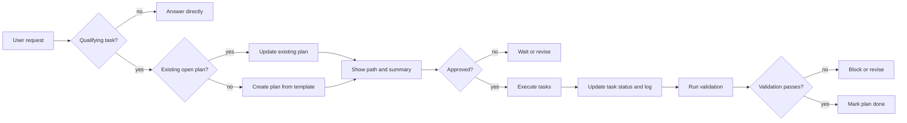

# Plan: Codex `plan-artifacts` Skill (v2)

Status: draft  
Version: 2  
Updated: 2026-09-16  
Approved: pending

## Summary

`plan-artifacts` is a local Codex Skill that turns a non-trivial implementation request into one reviewable Markdown plan file under `docs/plans/`. The skill entrypoint stays short; the reusable structure lives in a template. The generated plan file is both the review artifact and the execution checklist.

## Why v2

| V1 issue | V2 change |
|---|---|
| Plan was close to a full skill spec | Separate a short `SKILL.md` entrypoint from a reusable plan template |
| Trigger rules were too broad | Qualify by blast radius, ambiguity, and explicit user intent |
| Eleven required sections encouraged boilerplate | Keep a small mandatory core; omit empty optional sections |
| Eight-column task table was hard to maintain | Use a narrow task table plus short task notes |
| Diagrams could become decorative | Default to zero diagrams; include only when materially clarifying |
| Execution behavior was underspecified | Add approval gate, duplicate handling, drift policy, and execution log |

## Design decisions

| Decision | Choice |
|---|---|
| Packaging | Local Codex Skill first; no plugin or marketplace dependency |
| Location | `$CODEX_HOME/skills/plan-artifacts/`, or `~/.codex/skills/plan-artifacts/` if `CODEX_HOME` is unset |
| Artifact location | `docs/plans/YYYY-MM-DD-<short-slug>.md` |
| Artifact format | Markdown, optional YAML frontmatter, narrow tables, optional Mermaid diagrams |
| Default behavior | Generate and show a plan, then stop for approval |
| Reuse | Update an existing open plan when the topic matches; create a new file only when scope differs |
| Documentation | Keep short usage notes in `SKILL.md`; no separate README |

## Skill anatomy

```text
plan-artifacts/
├─ SKILL.md
├─ assets/
│  └─ plan-template.md
└─ agents/
   └─ openai.yaml
```

`SKILL.md` is the short decision layer. `assets/plan-template.md` is loaded only when a plan is generated. `agents/openai.yaml` provides UI metadata and keeps implicit invocation enabled.

### `SKILL.md` contract

The frontmatter description should be close to:

```yaml
name: plan-artifacts
description: Generate a structured plan file with task tables and diagrams before non-trivial multi-file, API/data-model, workflow, or ambiguous implementation work.
```

The body should cover only:

1. When to activate.
2. When not to activate.
3. Where to write the plan.
4. How to handle an existing plan.
5. What summary to show the user.
6. What may happen only after approval.
7. How to update task status and the execution log.
8. Pointer to the template.

### Trigger rules

Activate when any of the following is true:

- The task likely changes multiple modules or service boundaries.
- The task changes an API, data model, workflow, CLI contract, or test strategy.
- There are multiple viable implementation paths.
- The task has enough ambiguity that assumptions need review.
- The user explicitly asks for a plan.

Do not activate when:

- The request is a question, lookup, or short explanation.
- The change is a small single-file edit.
- The change is formatting, copy editing, or a mechanical rename.
- The user says `just do it`, `don't plan`, `skip planning`, or equivalent.

If uncertain, ask one concise question instead of generating a heavyweight plan.

## Plan artifact contract

The generated plan can use YAML frontmatter:

```yaml
---
id: YYYY-MM-DD-<short-slug>
title: <Task title>
created: YYYY-MM-DD
updated: YYYY-MM-DD
status: draft
---
```

The body uses these sections:

| Section | Required? | Purpose |
|---|---|---|
| `Goal` | yes | What will be delivered and why it matters. |
| `Non-goals` | yes | What is explicitly out of scope. |
| `Current understanding` | optional | Current behavior versus target behavior. |
| `Assumptions` | optional | Facts or interpretations the plan depends on. |
| `Tasks` | yes | Execution source of truth. |
| `Diagrams` | optional | Architecture, flow, state, or relationship clarification. |
| `File impact` | optional | Expected files and change types. |
| `Risks / open questions` | optional | What could go wrong or remain undecided. |
| `Validation` | yes | How completion is proven. |
| `Execution notes` | yes | Rules for implementing and updating the plan. |
| `Execution log` | optional | Running record of completed, blocked, or changed work. |

Empty optional sections must be omitted. The default target is a one-screen plan for medium tasks and at most two screens for complex tasks.

### Task table

Use a narrow table for scanability:

```markdown
| # | Task | Files | Validation | Status |
|---|---|---|---|---|
| 1 | Add refresh token model | `auth/models.ts` | unit test | pending |
```

Put dependencies, risk, and extra detail in short notes beneath the table or beneath the relevant task. Allowed task statuses are:

- `pending`
- `in-progress`
- `blocked`
- `done`
- `cancelled`

Most plans should contain 3-8 tasks. A genuinely large effort may exceed this, but the skill should prefer phases over exhaustive decomposition.

### Diagram policy

Default to zero diagrams. Include a diagram only when it materially clarifies the plan.

| Situation | Appropriate diagram |
|---|---|
| Architecture, data flow, ownership, or branching changes | `flowchart` |
| Multi-step interaction across UI, services, APIs, or agents | `sequenceDiagram` |
| State transitions, approval flow, or recovery behavior | `stateDiagram-v2` |
| Model or inheritance relationships | `classDiagram` |
| Persistent entities or data-model changes | `erDiagram` |

One diagram is enough for most complex plans. Use two only when they explain different things, such as architecture plus state transitions.

## Duplicate and drift handling

Before creating a plan:

1. Check `docs/plans/` for an existing plan with the same slug or substantially matching title.
2. If an existing plan is not `done` or `cancelled`, update it instead of creating a duplicate.
3. If the existing plan represents a materially different scope, create a new plan and mention the difference.

After approval:

- Small discoveries may be handled directly, but must be reflected in task notes or the execution log.
- Material scope changes require updating the plan and pausing for renewed approval.
- Failed validation should mark the task `blocked` and explain the blocker.
- High-risk changes outside the approved plan require explicit user confirmation.

## Lifecycle



The user saying `implement this plan`, `execute this plan`, or similar counts as approval. Merely approving the plan's content does not authorize unrelated work.

## Implementation tasks

| # | Task | Files | Validation | Status |
|---|---|---|---|---|
| 1 | Scaffold local skill | `SKILL.md`, `agents/openai.yaml` | New Codex session discovers `plan-artifacts` | pending |
| 2 | Write skill entrypoint | `SKILL.md` | Trigger, path, approval, and execution rules are clear | pending |
| 3 | Add plan template | `assets/plan-template.md` | Template matches the artifact contract and omits unused optional sections | pending |
| 4 | Add duplicate and drift rules | `SKILL.md` | Reused, updated, and blocked scenarios are covered | pending |
| 5 | Run behavioral tests | temporary workspaces | Positive, negative, and execution scenarios pass | pending |

### Task notes

1. Use the bundled skill initializer if available, then remove scaffold placeholders.
2. Keep the entrypoint short enough that it can be reviewed in one pass.
3. The template should be practical rather than exhaustive.
4. The duplicate check should not require a script for v1; a Codex search of `docs/plans/` is enough.
5. Test with one backend/API task, one multi-file refactor, one ambiguous task, and one small edit that should not trigger the skill.

## Validation

### Positive cases

- [ ] A non-trivial multi-file request creates a plan under `docs/plans/`.
- [ ] The plan has `Goal`, `Non-goals`, `Tasks`, `Validation`, and `Execution notes`.
- [ ] A medium task remains readable in one screen.
- [ ] A complex task includes at most two useful diagrams.
- [ ] A task interrupted after execution can resume from the same plan file.

### Negative cases

- [ ] A simple question does not create a plan.
- [ ] A small single-file edit does not create a plan.
- [ ] `just do it` bypasses planning.
- [ ] Empty optional sections are not emitted.

### Execution cases

- [ ] Codex stops after showing the plan path and summary.
- [ ] Codex does not implement before approval.
- [ ] `implement this plan` starts execution.
- [ ] Task statuses update in place.
- [ ] Material scope changes pause for renewed approval.

## Risks

| Risk | Mitigation |
|---|---|
| Skill triggers too often | Require meaningful blast radius or explicit planning intent. |
| Plans become boilerplate | Omit empty optional sections and cap task count by default. |
| Mermaid is unreadable in some viewer | Keep tables self-sufficient; diagrams only enhance. |
| Duplicate plans accumulate | Reuse an existing open plan when the topic and scope match. |
| Status gets stale | Update task status immediately after each meaningful change. |
| Execution expands scope | Pause and request renewed approval on material drift. |

## Changelog

| Date | Version | Change |
|---|---|---|
| 2026-09-16 | 2 | Rewrote plan around a short skill entrypoint, reusable template, narrower task tables, restrained diagrams, duplicate handling, and a clearer approval/execution contract. |
| 2026-09-16 | 1 | Initial proposal for an automatically generated structured plan file. |
