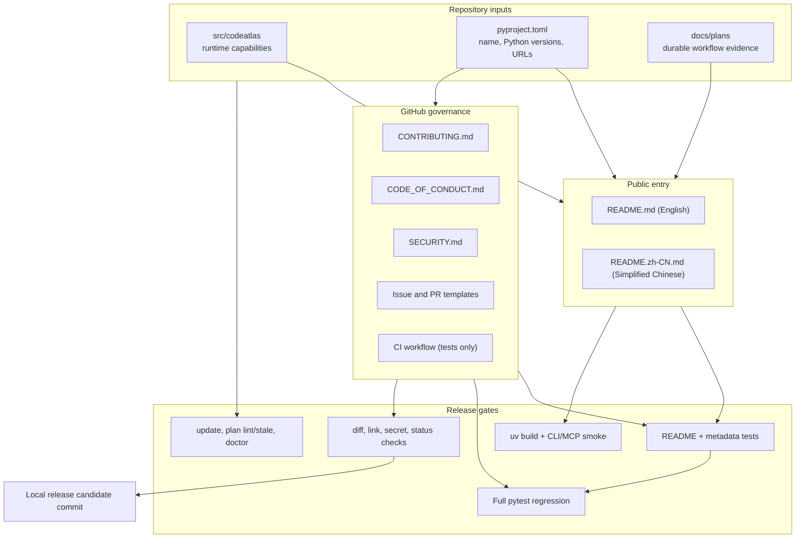
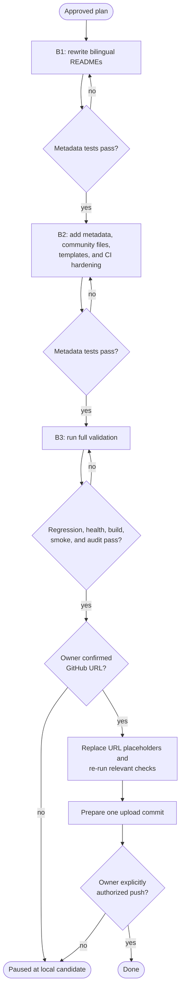

---
approval:
  approved_at: '2026-09-18T11:37:04Z'
  approved_by: Owner (chat approval)
  basis: conversation
  decision: approved
  gate_set_hash: sha256:d61fe20839ce280888646a99a932635701d385cc29b86819365ce657ec642dae
  notes: null
  profile_hash: sha256:a5a3707c9ac29b3daaa7955ebc458712165a31113c785bd9b2537e913e87088b
batch_started_revision: 4
change_control:
  mode: adaptive
content_hash: sha256:c04381547eb8b7a5148d2c156bc6ce2907202ea6d13b4826910dca440026aa1a
context_pages: []
created: '2026-09-18T00:00:00Z'
engineering:
  architecture_style: none
  gates:
  - blocking: true
    command:
    - .venv/Scripts/python.exe
    - -m
    - pytest
    - tests/test_repository_metadata.py
    - -q
    - -p
    - no:cacheprovider
    id: unit-tests
    kind: command
  - blocking: true
    command:
    - .venv/Scripts/python.exe
    - -m
    - pytest
    - -q
    - -p
    - no:cacheprovider
    id: regression-tests
    kind: command
  plain_language: false
  profile: product
  profile_revision: v13-builtins
  quality_gates:
  - unit-tests
  - regression-tests
  standards: []
evidence: []
files: []
gate_results:
- actor: trusted-runner
  artifact: null
  at: '2026-09-18T11:42:50Z'
  batch: B1
  evidence_kind: runner
  gate_definition_hash: sha256:465e17202ba60552707c4f1680854e59a5a53d5f0f3f9f239bde0aad5395db1a
  gate_id: unit-tests
  input_fingerprint: sha256:670196326b24d91d2029b3d118ece3f228e4b5bb7a1ae70045c292bd340c7cde
  outcome: passed
  output_digest: sha256:423b1d0e014eb1eab96f4420f7b344c2615be505dd574b756ac884826ca74f2d
  plan_revision: 5
  reason: null
id: 2026-09-18-github-release-readiness
last_writer: codex
owner: agent
reapproval_required: false
revision: 7
revision_type: state
schema_version: 1
status: executing
symbols: []
testing:
  approach: test-with-change
  manual_checks: []
  tests:
  - batch: B1
    behavior: Both language-specific READMEs expose equivalent navigation, current
      capabilities, source-only install, scope/lease behavior, MCP, limitations, roadmap,
      and license sections. Relative links must resolve.
    disposition: implement
    files:
    - tests/test_repository_metadata.py::test_readme_navigation_and_release_sections
    gate_id: unit-tests
    kind: unit
    task: 1
    test_id: T-001
  - batch: B2
    behavior: Repository metadata, contribution flow, code of conduct, security policy,
      issue templates, and pull-request template are present and internally linked.
    disposition: implement
    files:
    - tests/test_repository_metadata.py::test_repository_metadata_and_community_files
    gate_id: unit-tests
    kind: unit
    task: 2
    test_id: T-002
  - batch: B3
    behavior: Full regression and repository health checks protect documentation-only
      changes before GitHub upload.
    disposition: reuse
    files:
    - tests/
    gate_id: regression-tests
    kind: regression
    reason: Release-facing metadata and project URLs affect discoverability and CI
      expectations.
    task: 3
    test_id: T-003
title: GitHub Release Readiness
updated_at: '2026-09-18T11:42:57Z'
---
# Goal

Prepare the repository for public GitHub use without changing runtime behavior.
The public entry documents must accurately describe the current Phase 4 state:
scoped context VM, short-lived leases, durable plan workflow, plan context, and
the current MCP surface. The repository must also provide the contribution,
security, and conduct metadata expected by first-time GitHub visitors.

# Non-goals

- Do not publish to PyPI in this plan.
- Do not add semantic search, rollback, watchers, or description enrichment.
- Do not change public Python APIs or output schemas.
- Do not push to GitHub until the remote URL and upload authorization are explicitly confirmed by the owner.

# Tasks

| # | Batch | Task | Depends on | Risk | Files | Symbols | Validation | Status |
|---|---|---|---|---|---|---|---|---|
| 1 | B1 | Rewrite English and Simplified Chinese READMEs with current capabilities, source-only instructions, equivalent structure, one architecture view, and one usage flow view | none | medium | README.md, README.zh-CN.md, tests/test_execution_quality.py | none | unit-tests gate T-001 | done |
| 2 | B2 | Add repository metadata, community files, GitHub templates, verified project URLs, and minimal CI hardening | B1 | medium | pyproject.toml, .github/workflows/ci.yml, tests/test_execution_quality.py | none | unit-tests gate T-002 | pending |
| 3 | B3 | Validate the release candidate locally, replace URL placeholders, scan the release diff, and prepare the upload commit | B2 | low | none | none | regression-tests gate T-003 | pending |

# Validation

Run the tests named in the testing contract.

# Testing strategy

Use automated documentation contract tests for bilingual README parity and
repository metadata. Then run the full suite and CodeAtlas doctor before the
candidate is committed. A human must confirm the GitHub repository URL and
upload step before anything leaves the local workspace.

# Execution notes

Implement one validated batch at a time.

# Owner decisions

These decisions must remain explicit and must not be inferred:

- Final GitHub repository URL, visibility, and owner account.
- Whether to add a git remote and push from this workspace.
- Whether repository description, topics, and social preview should be set on
  GitHub.
- Whether `CONTRIBUTING.md` and `CODE_OF_CONDUCT.md` should use the default
  maintainer contact or GitHub communication channels.
- Whether badges may be added after the final URL is confirmed.

# Release architecture

The release change is documentation and metadata only. It must not create a
second source of runtime truth; all facts are checked against package and
source-level contracts.

# Release flow

# Engineering requirements

- README.md is the English entry point and links to README.zh-CN.md.
- README.zh-CN.md is the Simplified Chinese entry point and links back.
- Both READMEs use equivalent section ordering, GitHub Markdown, tables, and
  fenced code blocks.
- Public documentation must state supported languages, Python versions,
  source-only installation, current context scope precedence
  (`batch > plan > session > global`), short-lived scope leases, durable plan
  workflow, current MCP tool surface, and known limitations.
- Do not use PyPI or `uvx` install examples because this plan does not publish
  to PyPI.
- Do not hardcode test counts or MCP tool counts in public documentation.
- Use real demo symbols such as `TaskController` or `mark_done`; do not use
  `order_total`.
- Add only community files that GitHub natively discovers, plus a focused
  pull-request template.
- Keep CI focused on tests; add only low-risk workflow hygiene
  (`permissions`, `concurrency`, `timeout-minutes`, and `workflow_dispatch`).
  Do not add a release-publishing workflow.
- `pyproject.toml` URLs must match the owner-confirmed GitHub URL or use an
  explicit placeholder until it is confirmed.
- Generated artifacts (`.venv/`, `.codeatlas/state.db`, `.codeatlas/detail/`,
  and test scratch files) must not enter the release commit.

# Quality gates

unit-tests and regression-tests are blocking.

# Batches

| Batch | Purpose | Depends on | Status | Last validation |
|---|---|---|---|---|
| B1 | Bilingual README refresh | none | passed | 2026-09-18T11:42:57Z |
| B2 | GitHub metadata and community files | B1 | pending |  |
| B3 | Local validation and upload checklist | B2 | pending |  |

# B3 release checklist

Before preparing the upload commit, verify:

1. Full regression: `.venv/Scripts/python.exe -m pytest -q -p no:cacheprovider`.
2. Index health: `codeatlas update .`.
3. Plan health: `plan lint . --json` and `plan stale . --json`.
4. Project health: `codeatlas doctor`.
5. Package build: `uv build`.
6. CLI smoke: `codeatlas --help` and `codeatlas context status`.
7. MCP smoke: import/start `codeatlas-mcp` from the local source environment.
8. Whitespace check: `git diff --check`.
9. Relative-link check for READMEs, community files, and templates.
10. Secret-pattern scan and manual review of the release diff.
11. Final `git status --short --branch` confirms no unintended files.

# Execution log

- Started batch B1.
- Completed batch B1 with passing gate evidence.
